# Data Flow

[← Back to README.md](../README.md)

## Data Flow Diagram

Visualizes how PURL arrays are processed, external API calls (deps.dev / GitHub GraphQL & REST / OpenSSF Scorecard) are made, and results are assembled respecting Clean Architecture (DDD) boundaries.

### PURL Batch Processing — External API Calls and Data

```mermaid
flowchart LR
    A["PURLs / GitHub URLs"] --> B["Parse & validate<br/>PURL or URL kind"]
    B --> C["deps.dev: Fetch Package Info<br/>(parallel)"]
    C --> D{Has repository URL?}
    D -->|Yes| E["Normalize & Group by repo URL"]
    E --> F["deps.dev: Fetch Project Info (batch by repo)"]
    F --> G["Merge Package + Project"]
    D -->|No| H["Build basic result<br/>(package-only)"]

    G --> I["GitHub: Fetch metadata<br/>(parallel, rate-limited)"]
    I --> J["Scorecard: Run checks<br/>(parallel, respect quotas)"]

    H --> K["Domain: Aggregate → Analysis"]
    J --> K
    K --> L["Interfaces/CLI: CSV/Report"]

    classDef infra fill:#eef,stroke:#88f,stroke-width:1px;
    classDef app fill:#efe,stroke:#4a4,stroke-width:1px;
    classDef domain fill:#ffe,stroke:#cc4,stroke-width:1px;
    classDef iface fill:#fee,stroke:#f88,stroke-width:1px;

    class B,C,F,I,J infra;
    class E app;
    class K domain;
    class L iface;
```



### External API Calls and Retrieved Data

#### deps.dev — PURL Lookup (GET /v3alpha/purl/{purl})

- Returned Version fields: `versionKey.version`, `purl`, `publishedAt`, `isDefault`, `licenses`, `links (SOURCE_REPO)`, `relatedProjects`, etc.
- Purpose: Retrieve canonical package info; discover repository URL via SOURCE_REPO link
- Code: `DepsDevClient.fetchPackageInfo` (`internal/infrastructure/depsdev/depsdev.go`)
- Docs: <https://docs.deps.dev/api/v3alpha/>

#### deps.dev — Project Batch (POST /v3alpha/projectbatch)

Returns Project info for each projectKey (e.g., github.com/owner/repo):

- `ProjectKey.ID`, `StarsCount`, `ForksCount`, `OpenIssuesCount`, `License`, `Description`, `Homepage`
- Scorecard block: `date`, `repository{name, commit}`, `overallScore`, `checks{name, score, reason, details, documentation{url}}`

- Purpose: Enrich with repo-level metadata and OpenSSF Scorecard metrics
- Code: `DepsDevClient.fetchProjectsBatch` (`internal/infrastructure/depsdev/depsdev.go`)
- Types: `ProjectBatchRequest` (`internal/infrastructure/depsdev/api_types.go`)
- Docs: <https://docs.deps.dev/api/v3alpha/#getprojectbatch>

#### deps.dev — GetDependents (GET /v3alpha/systems/{system}/packages/{name}:dependents)

- Returned fields: `dependentCount`, `directDependentCount`, `indirectDependentCount`
- Supported ecosystems: npm, Maven, PyPI, Cargo (Go, NuGet, RubyGems not supported)
- Purpose: Retrieve package dependent count (UsedBy)
- Code: `DepsDevClient.FetchDependentCount`, `FetchDependentCountBatch` (`internal/infrastructure/depsdev/depsdev.go`)
- Types: `DependentsResponse` (`internal/infrastructure/depsdev/api_types.go`)
- Docs: <https://docs.deps.dev/api/v3alpha/>

#### RubyGems — Reverse Dependencies (GET /api/v1/gems/{name}/reverse_dependencies.json)

- Returns: Array of gem names that depend on the target
- Purpose: Retrieve dependent count for `pkg:gem/*` (deps.dev does not support RubyGems)
- Code: `Client.GetReverseDependencyCount` (`internal/infrastructure/rubygems/client.go`)
- Docs: <https://guides.rubygems.org/rubygems-org-api/>

#### Packagist — Package Info (GET /packages/{vendor}/{name}.json)

- Returned fields: `package.dependents`, `package.suggesters`, `package.favers`
- Purpose: Retrieve dependent count for `pkg:composer/*` (deps.dev does not support Composer)
- Code: `Client.GetDependentCount` (`internal/infrastructure/packagist/client.go`)
- Note: Reuses existing `fetchPackage` cache (shared with `GetAbandoned` / `GetRepoURL`)
- Docs: <https://packagist.org/apidoc>

#### deps.dev — Releases (GET /v3alpha/systems/{ecosystem}/packages/{name})

- Returns: Versions list (`versionKey.version`, `publishedAt`, `isDefault`)
- Purpose: Identify latest stable/dev/requested version and freshness
- Code: `DepsDevClient.fetchLatestRelease`, `DepsDevClient.fetchReleaseInfoBatch` (`internal/infrastructure/depsdev/depsdev.go`)
- Docs: <https://docs.deps.dev/api/v3alpha/>

#### GitHub — GraphQL (POST https://api.github.com/graphql)

- Query repository(owner, name) fields: `isArchived`, `isDisabled`, `isFork`, `defaultBranchRef{name, target{... on Commit { history(first:N){nodes{committedDate, author{user{login}}}}}}}`、`rateLimit{cost, remaining, resetAt}`
- Purpose: Evaluate repository state (archived/disabled/fork) and recent commit activity
- Code:
  - Basic info query: `Client.FetchBasicRepositoryInfo` (`internal/infrastructure/github/client.go`)
  - Batch orchestration: `Client.FetchRepositoryStatesBatch`
  - HTTP + query execution: `Client.executeGraphQLQuery`
- Docs: <https://docs.github.com/en/graphql>

### Implementation Notes

- Parallelism is placed in the Infrastructure layer; Application coordinates; Interfaces stays thin
- Grouping and batching (e.g., repo URL → project batch) reduces API calls and improves throughput
- Repository URLs are normalized before GitHub / Scorecard calls to avoid duplicates and mismatches

### Assessment Precision: Two-Path Architecture

The lifecycle assessor uses two distinct decision paths depending on `GITHUB_TOKEN` availability:

```text
┌─────────────────────────────────────────────────────────────────────┐
│ Path A: With GITHUB_TOKEN (high precision)                         │
│                                                                     │
│ Data: deps.dev + GitHub commits + OpenSSF Scorecard                │
│                                                                     │
│ Capabilities:                                                       │
│  • Human commit recency → Active/Stalled/Legacy-Safe               │
│  • VCS-direct ecosystem detection (Go, Composer)                   │
│  • Scorecard absence vs. low score distinction                     │
│  • Zero-advisory + dormant commit → Legacy-Safe                    │
│  • Unpatched vulns + dormant → EOL-Effective                       │
│  • Archive/disable status → EOL-Confirmed                          │
├─────────────────────────────────────────────────────────────────────┤
│ Path B: Without GITHUB_TOKEN (basic precision)                     │
│                                                                     │
│ Data: deps.dev only (publish dates, advisories)                    │
│                                                                     │
│ Capabilities:                                                       │
│  • Publish recency + advisories → coarse classification            │
│  • No commit signals → cannot detect active-but-unpublished        │
│  • Packages with commits but no publish → misclassified as Stalled │
└─────────────────────────────────────────────────────────────────────┘
```

The domain layer branches on `Analysis.HasCommitData()` to prevent sentinel values (9999 days) from leaking into commit-based comparisons when commit history is unavailable. See [Assessment Precision](../README.md#assessment-precision-by-data-availability) for the full capability comparison.

---

## EOL Detection

EOL detection uses two complementary approaches:

### 1. Registry Heuristics (`eolevaluator`)

Automatic detection from external registry APIs (built-in):
- PyPI classifiers (`Development Status :: 7 - Inactive`)
- npm deprecated flag
- Packagist abandoned flag
- NuGet deprecated flag
- Maven relocated artifact

### 2. Custom Catalog via AnalysisEnricher

External callers can inject EOL catalog data via the `WithEnricher` hook. See [Library Usage](library-usage.md) for details on the enricher pattern, catalog JSON format, and integration flow.
